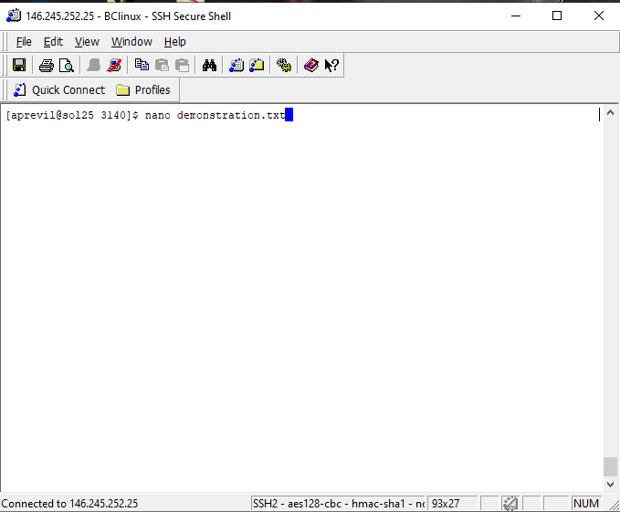
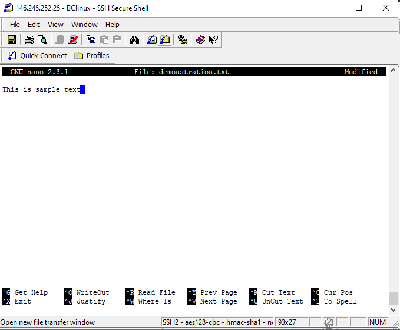
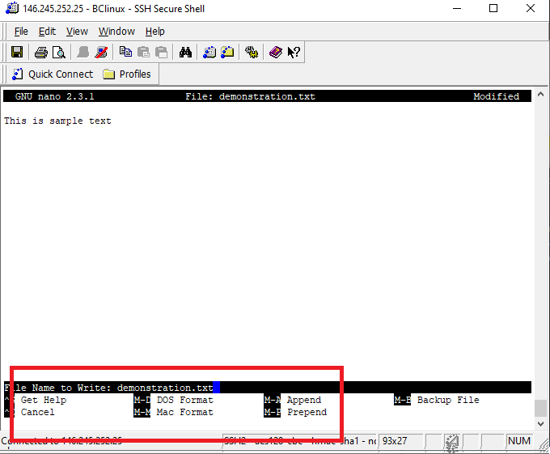
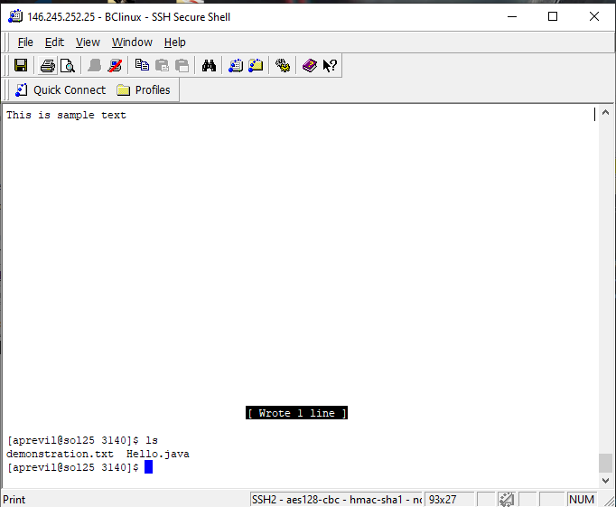

# Instructions to log onto linux server and how to use some programs
## Part 1: Connecting to the linux server

&nbsp;&nbsp;&nbsp;&nbsp;1) Open SSH Secure Shell Client\
&nbsp;&nbsp;&nbsp;&nbsp;2) On the bottom-most task bar, click on [Profiles](./pictures/profiles.png), Add Profile,and give it a name. I will name it BClinux for this example.\
&nbsp;&nbsp;&nbsp;&nbsp;3)Click on Profiles once again and this time click [edit profiles](./pictures/edit.png)\
&nbsp;&nbsp;&nbsp;&nbsp;4)Once the menu pops up, make sure your [desired profile](./pictures/profilelist.png) is highlighted on the left\
&nbsp;&nbsp;&nbsp;&nbsp;5)On the right, click the Connection tab at the top and you should see [three fields](./pictures/fields.png) for the host name, user name, and port number. Enter an IP address listed [here](http://www.sci.brooklyn.cuny.edu/~ziegler/CISC3115/SSH/LINUX_RemoteAccess.pdf) and your linux server login and choose port number 22. then click Ok at the bottom\
&nbsp;&nbsp;&nbsp;&nbsp;6)Now, go to the profiles button again on the bottom tab and choose your profile. You should be given a prompt that you've connected to the Brooklyn college linux server and another prompt to enter your password to your linux account.\
&nbsp;&nbsp;&nbsp;&nbsp;7)You are now connected to the linux server and only need to repeat step 6 to log on in the future!

## Part 2: linux programs
### Some common programs you might use while on the linux server
>common linux commands:
>>ls: list files in a directory
>>>ls -a to list hidden files as well\
>>mkdir to create a new directory
>>touch "file name" to create a new file
>>cd "directory name" to change to a directory cd .. to go back to the parent directory
>>mv to move or rename a file. the format is "mv sourcefile renametofile" or "mv sourcefile filedirectory. NOTE: in the school linux terminal you must specify the path of the target directory with ~ first ex: ~/3140
>>rm "file name" to delete a directory or file name

>vim: text editor
>nano: text editor which is a clone of pico and is a more user friendly
>git: version control software. commands are the same as on git bash
>Type the name of a program to open it. You can also use the "whatis <filename>" on these programs to get a description of what they do
curl		wget		subversion
awk		    java		git
guile		gimp		inkscape
ffmpeg		vim		    nano
emacs		mysql		sqlite
gzip		zip		    make
head 		tail		libreoffice
convert

## Part 3: using a text editor

I will be using nano for this quick demonstration of how to use a text editor.
>1) type nano or  (must use quotes if you have spaces) and press enter
>2) begin typing what you wish in the . use Ctrl + J to add your current line to the previous one
>3)To save and exit, press CTRL + X and then choose either Y or N to save your changes
>4)If you press Y, you will see the  option. Here you can type type in the name of your file and the extension if you did not do so previously, or edit what you had previously then press enter to save. Your file is now v if you use the command ls and you can edit it once again with the command nano and the file name

### Creating and running code
Java will be used in this example.
To create and run a java file, follow the steps in part 3 and write and save the file as a .java extension, then in the terminal once you exit, run the command javac "yourfilename.java" and then run the command java "yourfilename" (without the extension) and your java file will run.