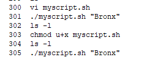
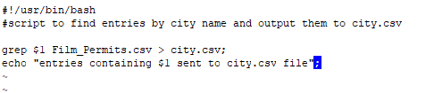

## Task 1:
    
 Find and print all of the film permits in brooklyn to a separate csv file.\
    Dataset: Film Permits from [NYC.gov](https://data.cityofnewyork.us/City-Government/Film-Permits/tg4x-b46p)\
    Answer:\
    

## Task2:
Do the above inside of a bash script\
Answer:\
    History\
    \
    Script file:\
    